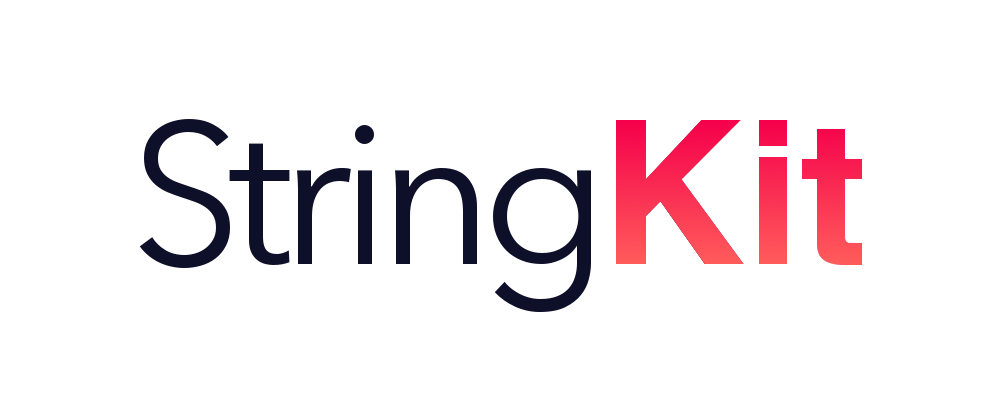

[](#StringKit)
[](https://swift.org)
[](https://developer.apple.com)
[](#StringKit)
[](/LICENSE.md)

StringKit is a new, simple and fast way to investigate and modify strings in Swift - The next level of string manipulation.

# Installation
## Requirements
+ iOS 8.0+
+ Xcode 8.1+
+ Swift 3.1+

## Manual
1. Download the ZIP archive.
2. Add the .framework file to the embedded binaries section.
3. That's it. :]

## Package Managers
[](#installation)

[](#installation)

[](#installation)

## Import
```swift
import StringKit
```

# Offline Documentation
StringKit provides an offline documentation, so you have fast access to the entire bunch of methods and properties. It is also possible to categorize.

## Usage
```swift
String.documentation(option: SKStringDocumentationOption)
```

### Categories:
```swift
public enum SKStringDocumentationOption
{
  case all // standard
  case investigation
  case modification
  case conversion
}
```

You will get an output in the console inside of the debug area.

## Author
Rainer Niemann, rainerniemann@icloud.com

## License
This project is licensed under the MIT License. See the [LICENSE.md](/LICENSE.md) file for details.
